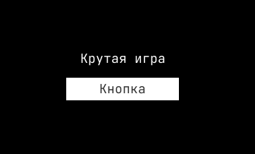

# Локализация

## Создание переводов

Для начала создайте папку `i18n` в которой будут лежать файлы формата JSON, в которых и будут храниться ваши переводы.

В качестве примера создадим файлы `en.json` и `ru.json`, которые соответствуют английскому и русскому языкам.

<figure><figcaption></figcaption></figure>

Теперь, стоит наполнить наши файлы каким-нибудь содержанием. В файл `en.json` добавим пару строчек на английском:

```json
{
  "game": {
    "title": "Cool Game"
  },
  "button": "Button"
}
```

А в `ru.json` на русском:

```json
{
  "game": {
    "title": "Крутая игра"
  },
  "button": "Кнопка"
}
```

## Получение переводов

Чтобы получить значение определённого ключа, вы можете воспользоваться методом `i18n.localize(key)`.

```lua
print( i18n.key("game.title") ) -- "Cool Game"
```

Также существует вспомогательный метод `i18n.gui(node_id, key)`, который заменяет содержимое выбранного узла в пользовательском интерфейсе.

С помощью `i18n.gui` мы можем сократить:

```lua
gui.set_text(gui.get_node("Title Label"), i18n.key("game.title"))
```

До:

```lua
i18n.gui("title_label", "game.title")
```

## Пример локализации игры&#x20;

```lua
local i18n = require('ysdk.i18n')

local function on_localize()
    i18n.gui("title_label", "game.title")
    i18n.gui("button_label", "game.title")
end

function init(self)
    i18n.on(on_localize)
end

function final(self)
    i18n.off(on_localize)
end
```

<div align="center">

<figure><figcaption><p>Пример локализации игры</p></figcaption></figure>

</div>

## Смена языка переводов


Модуль `i18n` самостоятельно инициализирует язык, соответствующий языку пользователя из [переменных окружения](sdk-methods/environment.md).

Рекомендуется использовать данный метод только если хотите вручную изменить язык по желанию от пользователя.


Чтобы сменить язык перевода, вы можете воспользоваться методом `i18n.set_language(code: string)`.

```lua
function settings.change_language(code)
    i18n.set_language(code)
end
```
