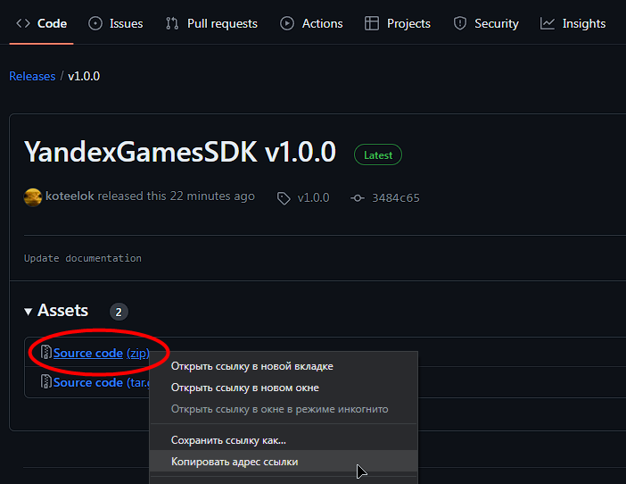
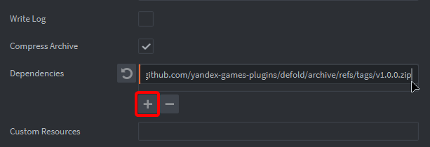
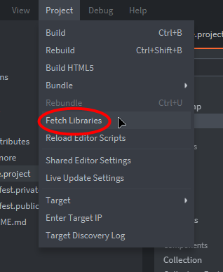

# Установка плагина

Чтобы начать использовать Яндекс.Игр SDK, вам необходимо добавить плагин в зависимости проекта.

Для этого перейдите в раздел [Releases](https://github.com/yandex-games-plugins/defold/releases/latest) и скопируйте ссылку на файл `Source code (.zip)`.

<figure><figcaption></figcaption></figure>

Далее откройте свой проект, перейдите в настройки проекта (`game.project`), после чего в список `Dependencies` добавьте скопированную вами ссылку.

<figure><figcaption></figcaption></figure>

После нажмите на `Project -> Fetch Libraries`, чтобы загрузить плагин в проект из GitHub.

<figure><figcaption></figcaption></figure>
